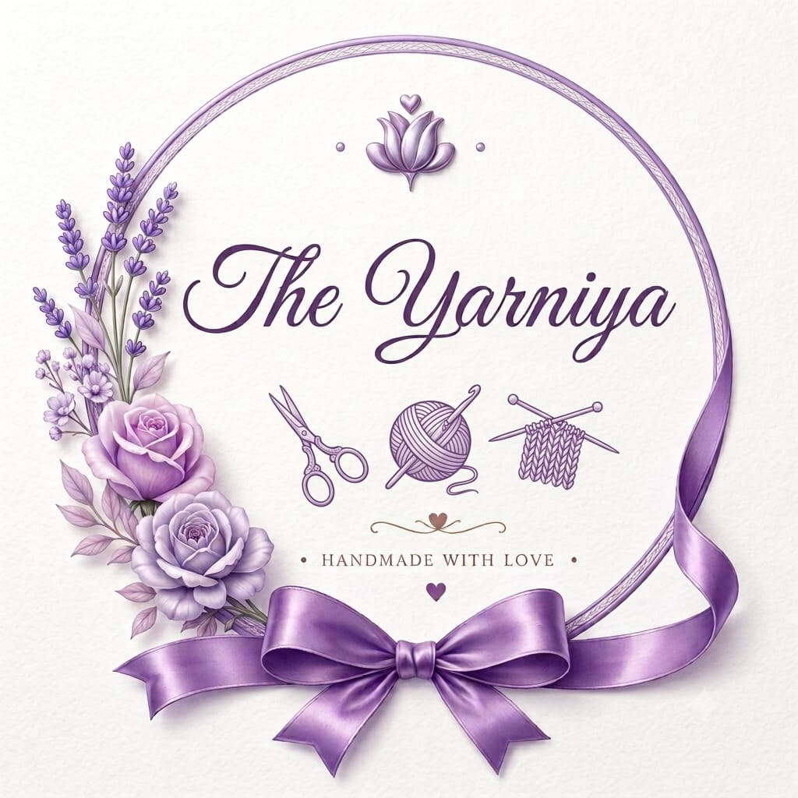

<div align="center">



# 🧶 The Yarniya

### *Handmade crochet, made with love*

[](https://the-yarnia.netlify.app/)
[](https://wa.me/918637505579)
[](https://www.instagram.com/the_yarniya)

</div>

---

## 🧶 About

**The Yarniya** is a handmade crochet studio — keychains, bag charms, hair accessories, hanging planters, and custom crochet bouquets, each one crocheted by hand, one stitch at a time.

100% handcrafted with love & care. Made to be given, kept, or carried every day.

> *"Handmade with love, one stitch at a time."*

---

## ✨ What We Offer

| 🔑 Keychains | 🎀 Hair Accessories | 🌹 Bag Charms |
|:---:|:---:|:---:|
| Swiss roll, sunflower, daisy & mesh bow keychains | Gajra, scrunchies, bandanas & hair bands | Rose, tulip & lily-of-the-valley charms |
| From **₹79** | From **₹149** | From **₹149** |

### 🧺 Also available
Crochet Hanging Lavender Pot · Custom Crochet Bouquets (Rose, Lily, Tulip, Sunflower, Daisy)

### 🎊 Delivery
All India Delivery Available · Cash on Delivery is **not** accepted (prepaid orders only)

---

## 🌸 Build a Custom Bouquet

Visit **[the-yarnia.netlify.app](https://the-yarnia.netlify.app/)** and use the live **Bouquet Builder**:

1. 🌹 Pick your flowers and quantities
2. 📋 Watch the live crochet-bouquet preview update
3. 💰 See the price as you go (Rose is tier-priced; other flowers show "price to be confirmed" until finalised)
4. 📲 Send the bouquet straight to us on WhatsApp or Instagram

---

## 📲 Order Now

The fastest way to order:

**[👉 Open WhatsApp → +91 86375 05579](https://wa.me/918637505579)**

Or message us on **[Instagram @the_yarniya](https://www.instagram.com/the_yarniya)**, or fill in the contact form at [the-yarnia.netlify.app/#contact](https://the-yarnia.netlify.app/#contact)

---

## 💻 About This Repository

This is the source code for The Yarniya website — a fully custom storefront built with pure **HTML, CSS, and JavaScript**. No frameworks, no build step.

### Features
- 🛍️ Centralized product catalog (`data.js`) — real photos, real prices, nothing invented
- 🌹 Interactive SVG bouquet builder with Fibonacci-spiral layout and tier-priced roses
- 🖼️ Multi-photo product galleries with thumbnail switching
- 💰 Multi-currency display (₹ INR default + USD, EUR, GBP, AED, JPY)
- 📲 WhatsApp ordering with a pre-filled order summary
- 📧 Contact form via Formspree
- 🌙 Light / Dark / System theme
- 📱 Fully mobile responsive, accessible, and `prefers-reduced-motion`-aware

### Tech Stack
```
HTML5 · CSS3 · Vanilla JavaScript
Hosted on Netlify · Contact forms via Formspree
```

### Project Structure
```
The-Yarniya-Website/
├── index.html          ← Main page
├── data.js             ← All product/brand data — edit here to add products or change prices
├── script.js           ← Rendering + bouquet builder logic
├── style.css           ← Styles + dark mode + responsive
├── manifest.json       ← PWA manifest
├── assets/
│   ├── brand/           ← Logos, favicon
│   └── products/         ← Product photos
├── netlify.toml         ← Security headers for Netlify
├── LICENSE
├── README.md
└── SECURITY.md
```

### Adding a product
Open `data.js` and add an entry to the `PRODUCTS` array with a name, category, price (or `null` if not finalized), and an `images` array. No other file needs to change.

### Run Locally
```bash
git clone https://github.com/adityadas06062004-png/The-Yarniya-Website.git
cd The-Yarniya-Website
open index.html
# or
npx serve .
```

---

## 📍 Find Us

| Platform | Link |
|---|---|
| 🌐 Website | [the-yarnia.netlify.app](https://the-yarnia.netlify.app/) |
| 📸 Instagram | [@the_yarniya](https://www.instagram.com/the_yarniya) |
| 💬 WhatsApp | [+91 86375 05579](https://wa.me/918637505579) |

---

<div align="center">

Made with 🧶 by **The Yarniya**

*© 2026 The Yarniya — All rights reserved*

</div>
